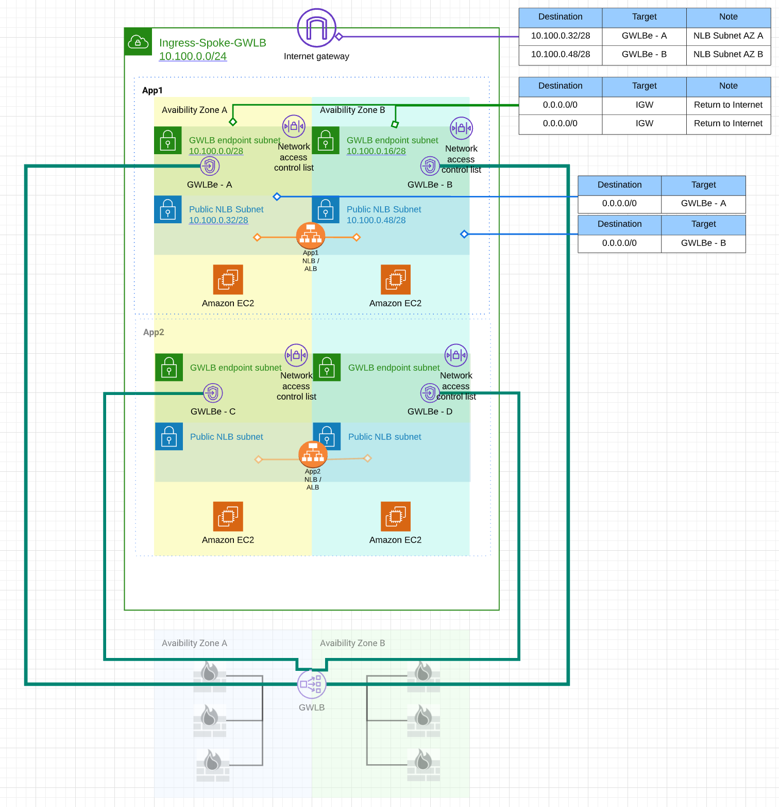

## Prerequsits
Code is currently developed to run locally with following:

* Linux (Windows Subsystem for Linux)
* Terraform

Following environment variables need to be set
```bash
# environment variables
export AWS_ACCESS_KEY_ID='AK**************'
export AWS_SECRET_ACCESS_KEY='************************'
```

## Tested environment:
```bash
$ terraform --version

Terraform v1.0.11 on linux_amd64
+ provider registry.terraform.io/aviatrixsystems/aviatrix v2.21.1-6.6.ga
+ provider registry.terraform.io/hashicorp/aws v3.74.3
+ provider registry.terraform.io/hashicorp/http v2.1.0
+ provider registry.terraform.io/hashicorp/null v3.1.0
+ provider registry.terraform.io/hashicorp/random v3.1.0
```

```bash
$ aws --version
**aws-cli/2.3.2** Python/3.8.8 Linux/5.10.60.1-microsoft-standard-WSL2 exe/x86_64.ubuntu.20 prompt/off
```

```
Palo Alto Networks VM-Series Next-Generation Firewall (BYOL)
10.1.3
```


## How to run
1. Modify **variables.tf** provide:
    * make sure the AZ zone ID match existing GWLB endpoints zone IDs.
    * EC2 key pair name for test web servers
    * Region of the deployment
    * VPC name
    * VPC CIDR
    * GWLB Endpoint Service - Service Name
    * Declaration of subnets for GWLB endpoints
    * Declaration of subnets for NLB/ALB
    * Declaration of subnets for Aviatrix Spoke Gateways
    * Declaration of subnets for test web servers
2. Test web servers are deployed on subnets with 0/0 pointing to IGW, this is to allow the initial bootstrap of web server. You may remove 0/0 route after the deployment.
3. For cross account access, add permission on the endpoint service, so that the other account can create service endpoint:
https://docs.aws.amazon.com/vpc/latest/privatelink/add-endpoint-service-permissions.html

## Environment creates by the code
* GWLBe-Spoke VPC
    * IGW & Edge Route
    * GWLBe subnets and Route Tables
    * Load Balancer subnets and Route Tables
    * GWLB endpoints
    * GWLBe-Spoke local App Subnets
    * GWLBe-Spoke local test Web Servers
    * GWLBe-spoke local ALB/NLB pointing to local test Web Servers


